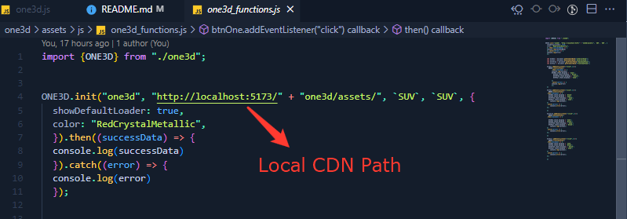

# Assessment -> 2

## ONE3D Functions Documentation -> Integrate the ONE3D package

### JavaScript 3D library

The aim of the project is to create an easy-to-use, lightweight, cross-browser, general-purpose 3D library. The current builds only include a WebGL renderer but WebGPU (experimental), SVG and CSS3D renderers are also available as addons.

**Usage**

This code creates a scene, 3D model object. It then creates a WebGL renderer for the scene and camera, and it adds that viewport to the document.body element. Finally, it View the 3D model in all sides scene for the camera.

### How to Install one3d library

```
npm install one3d
```

#### How To Use

Create the js file and import the package

````
import {ONE3D} from "./one3d";


ONE3D.init("one3d", "Path" + "one3d/assets/", `ONE3D_Model_ID`, `ONE3D_Variant_ID`, {
  showDefaultLoader: true,
  color: "RedCrystalMetallic",
  }).then((successData) => {
  console.log(successData)
  }).catch((error) => {
  console.log(error)
  });
  
````

## Important 

Cmd  Run 

````
npx vite

(or)

npx Serve
````

## Cdn Path -> Your Local CDN Path

```
var script = document.createElement("script");
script.src = "'CDN PATH'/one3d/assets/`ONE3D_MODEL_ID`/one3d_functions.min.js";
script.type = "text/javascript";
script.onload = function () {
//Callback on file load
//Call ONE3D.init('div_id','URL',`ModelName`,`VariantName`,{})
};
document.getElementsByTagName("head")[0].appendChild(script);

````




